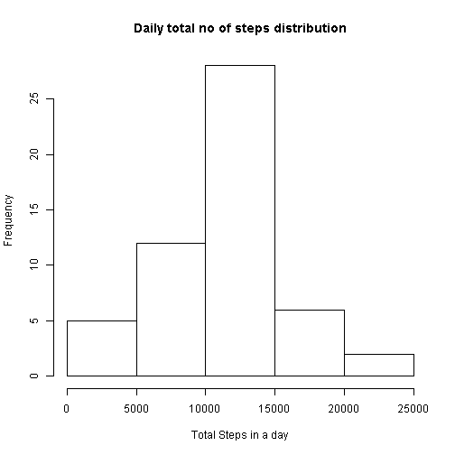
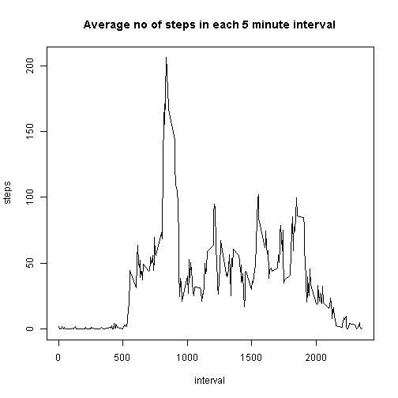
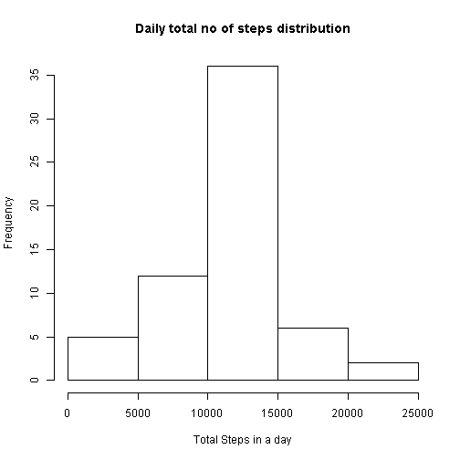
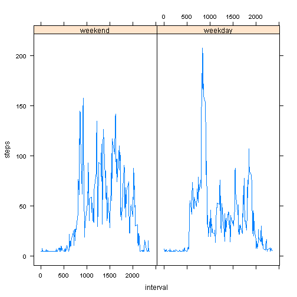

Activity Tracker Data Analysis 
==============================================================================
output: 
  html_document:
    keep_md: true

## Getting data
We will load data from the csv file and load it in an R dataframe. 


```r
library("lattice")
zipF<- "activity.zip"
unzip(zipF)
activityData <- read.csv('activity.csv')
```

### Histogram of daily step totals 


```r
dailyGroupeData <- aggregate(steps ~ date, activityData, sum)
hist(dailyGroupeData$steps, xlab="Total Steps in a day", main = "Daily total no of steps distribution")
```



```r
meanSteps <- mean(dailyGroupeData$steps)
medianSteps <- median(dailyGroupeData$steps)
```

### Mean of total steps per day is 1.0766189 &times; 10<sup>4</sup> and median is 10765


Time series plot for total no of steps in each 5 minute interval 


```r
intervalAggregate <- aggregate(steps ~  interval, activityData, mean)
plot(steps ~ interval , data = intervalAggregate, type = "l",main = "Average no of steps in each 5 minute interval")
```



```r
maxIntervalRow <- intervalAggregate[which.max(intervalAggregate$steps),]
maxInterval <- maxIntervalRow$interval
```

### Max interval is 835 


```r
completeData <- complete.cases(activityData)
noOfmissingCases <- sum(!completeData)
```

No of entries with missing data is 2304

Filling missing data for a step with average no of steps in that interval


```r
FilledData <- activityData
FilledData[is.na(FilledData$steps),"steps"] <-  mean(FilledData[,"steps"], na.rm = TRUE)
```


### Histogram of daily step totals with missing data filled


```r
dailyGroupeFilledData <- aggregate(steps ~ date, FilledData, sum)
hist(dailyGroupeFilledData$steps, xlab="Total Steps in a day", main = "Daily total no of steps distribution")
```



```r
meanFillSteps <- mean(dailyGroupeFilledData$steps)
medianFillSteps <- median(dailyGroupeFilledData$steps)
```


### Mean of total steps per day after filling data is 1.0766189 &times; 10<sup>4</sup> and median is 1.0766189 &times; 10<sup>4</sup>

Hence we can se that distribution and mean median remain almost same after filling missing values. 


### Analysing no of steps change over weekdays and weekend 


```r
FilledData$date <- as.Date(FilledData$date)
weekdays1 <-
c('Monday', 'Tuesday', 'Wednesday', 'Thursday', 'Friday')
FilledData$isWeekDay <-
factor((weekdays(FilledData$date) %in% weekdays1),
levels = c(FALSE, TRUE),
labels = c('weekend', 'weekday'))
FilledintervalAggregate <- aggregate(steps ~  isWeekDay + interval, FilledData, mean)
xyplot(steps ~ interval | isWeekDay, data = FilledintervalAggregate, type = "l")     
```


